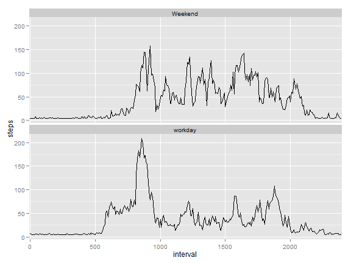

# Reproducible Research: Peer Assessment 1

## Loading and preprocessing the data


```r
df <- read.csv("activity.csv")
library(plyr)
library(ggplot2)
```

## What is mean total number of steps taken per day?


The mean total number of steps taken per day is 9354.2295 and the median is 10395

## What is the average daily activity pattern?

The 2012-11-23 contains the maxium steps 21194.

## Imputing missing values


The total NA in data set is 2304. The mean total number of steps taken per day is 1.0766 &times; 10<sup>4</sup> and the median is 1.0766 &times; 10<sup>4</sup>. They are different than old data set.

## Are there differences in activity patterns between weekdays and weekends?


The patterns are slightly differnt. See the figures.
